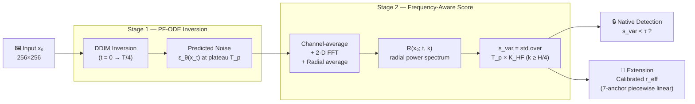

# [ECCVW 2026] PixRes

**Noise Frequencies Let a Pixel-Space Diffusion Prior Detect Native-Resolution Image**

[Bumsoo Kim<sup>1,\*</sup>](https://bumsookim00.com/), Hyun-Jun Jin<sup>2,\*</sup>, [Mi Young Lee<sup>1</sup>](https://scholar.google.com/citations?user=bxWgGnoAAAAJ), [Seungmin Rho<sup>1</sup>](https://scholar.google.com/citations?user=k5aAQxUAAAAJ), [Sanghyun Seo<sup>1,†</sup>](https://scholar.google.com/citations?user=k1SL428AAAAJ)<br>
<sup>1</sup>Chung-Ang University, Republic of Korea<br>
<sup>2</sup>Korea University, Republic of Korea<br>
<sup>\*</sup>Now with Smilegate AI &nbsp;·&nbsp; <sup>†</sup>Corresponding Author

[](https://gh-bumsookim.github.io/PixRes/)
[-orange)]()
[](https://github.com/gh-BumsooKim/PixRes)

---

## Overview

PixRes is a **training-free, zero-shot** native-image detector built on a pre-trained pixel-space diffusion prior. Given an input at any nominal resolution, it decides whether the image is genuinely native or has been silently upsampled &mdash; and, as a byproduct, predicts a continuous effective resolution &mdash; **without any labelled resolution data or fine-tuning**.

The insight: when a pixel-space diffusion model is asked to explain a native image via PF-ODE inversion, its predicted noise looks *featureless* in the high-frequency band; when the input is a resampled (upscaled) one, the same predicted noise develops a structured bulge in that band. A single scalar &mdash; the joint standard deviation of the high-frequency radial spectrum over plateau timesteps &mdash; captures this gap and delivers **0.953 pooled AUC** across 8 domains (+0.035 over the supervised SS-ERE baseline).

## Pipeline



## Method

PixRes has two stages, then a single scalar decision:

1. **PF-ODE Inversion.** The input image is deterministically inverted back to noise via DDIM up to `t = T/4`; predicted noise `ε_θ(x_t)` is collected at plateau timesteps `T_p = {100, 150, 200, 250}` where the signal is most discriminative.

2. **Frequency-Aware Score.** The predicted noise is channel-averaged, transformed via 2-D FFT, then radially averaged to obtain the power spectrum `R(x₀; t, k)`. The final score is the joint standard deviation across the plateau × high-frequency band `K_HF = {k : H/4 ≤ k < H/2}`:

    <p align="center"><code>s_var(x₀) = std<sub>(t, k) ∈ T_p × K_HF</sub> R(x₀; t, k)</code></p>

3. **Native Detection.** A single threshold on `s_var` separates native from resampled images. On a native input, `s_var` stays low (spectrum matches the prior); on a resampled one, it climbs (spectrum mismatch shows up as a bulge in the HF band).

4. **Extension &mdash; Calibrated r_eff.** A piecewise-linear calibration built from 7 DIV2K-val anchors (`r_d ∈ {64, 96, 128, 160, 192, 224, 256}`) turns `s_var` into a continuous effective-resolution prediction.

The backbone is the OpenAI ADM 256×256 unconditional diffusion model &mdash; **no fine-tuning, no supervision**.

## Code Release Roadmap

- [ ] Frequency-aware score (`s_var`) computation
- [ ] Native-detection threshold selection
- [ ] Calibrated `r_eff` regression
- [ ] SS-ERE baseline wrapper (parity with our pipeline)
- [x] Project page (`gh-pages` branch)

## Acknowledgements

This project builds upon the following excellent open-source works:

- [**guided-diffusion**](https://github.com/openai/guided-diffusion) &mdash; OpenAI ADM-256 unconditional pixel-space diffusion backbone
- [**SS-ERE**](https://github.com/hkansy/SS-ERE) &mdash; supervised baseline (Kansy et al., WACV 2023)

Evaluated on DIV2K, FFHQ, COCO, BSD100, Urban100, WikiArt, Set5, Set14.

## Citation

```bibtex
TBD
```
